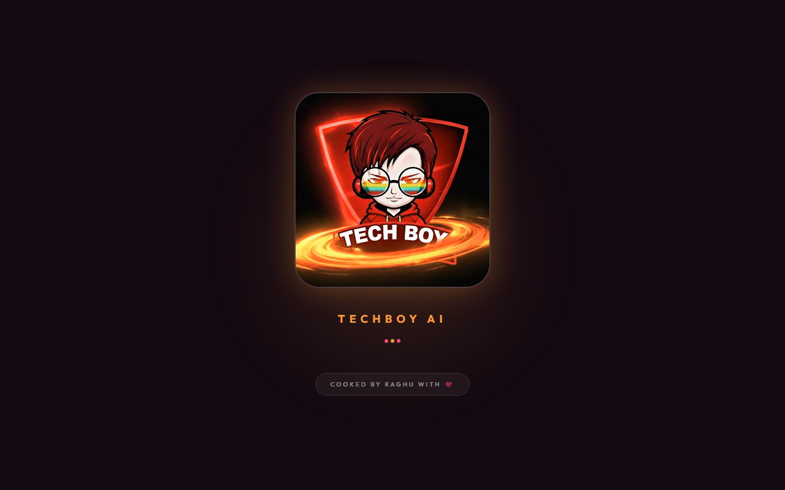
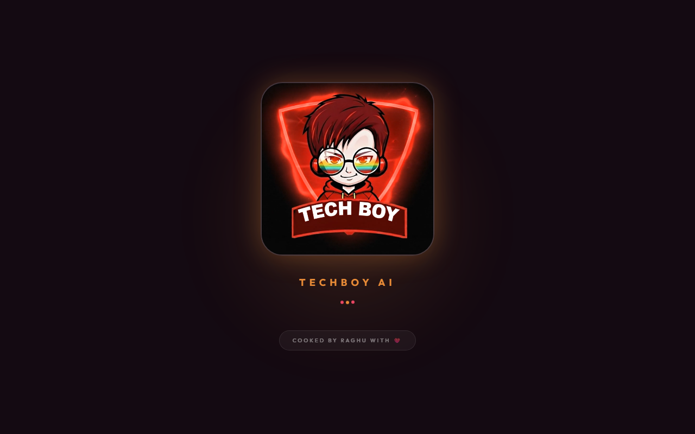
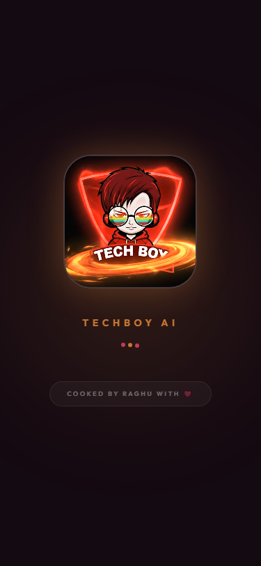
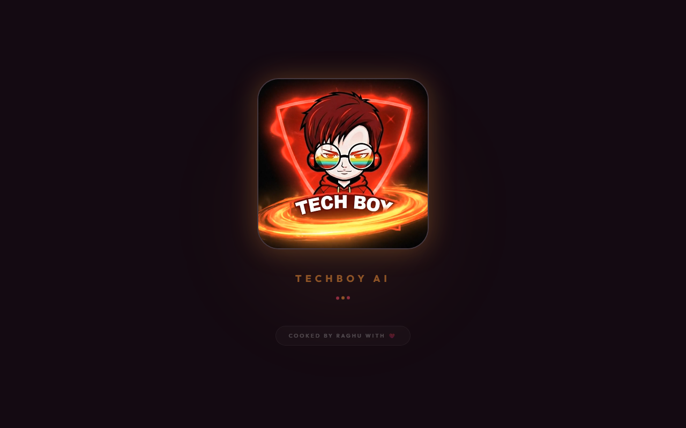

# 🤖 TECHBOY AI - Personal AI Chatbot & Portfolio Assistant


> *A premium sunset-themed AI chatbot with liquid glassmorphism design*

## 🌅 Live Demo

**[View Live Application →](https://chimataraghuram.github.io/TECHBOY-AI/)**

---

## 📋 About

**TECHBOY AI** is an intelligent, interactive Personal AI Chatbot and Portfolio Assistant designed and developed entirely by **Chimata Raghu Ram**. Rather than a traditional static portfolio page, this project is a **Conversational AI Web Application** that acts as a virtual representative. 

At its core, it integrates **Google's Gemini 2.0 Flash API** to generate real-time, streaming responses, enabling users to naturally inquire about the author's skills, experience, and projects. 

Beyond its functional AI capabilities, TECHBOY AI serves as a masterclass in modern frontend engineering. It is a fully responsive React application that implements a complex, custom-built **Sunset Glassmorphism** design system. This includes layered backdrop blurs, fluid jelly interactions, and dynamic radial ambient lighting—all engineered without relying on pre-built component UI libraries. This project is a testament to the intersection of artificial intelligence and premium UI/UX design.

---

## 📸 Screenshots

<div align="center">
  
  
  <br/>
  
  
</div>

### ✨ Key Features

- 🎨 **Sunset Glass Design** - Warm amber/rose color palette with heavy glassmorphism
- 🔮 **Radial Glowing Background** - Animated ambient light effects
- 🍇 **Jelly Button Effects** - Premium tactile interactions
- 💬 **AI-Powered Chat** - Intelligent responses using Google's Gemini API
- 📱 **Fully Responsive** - Optimized for all devices
- ⚡ **Smooth Animations** - Fluid transitions and micro-interactions
- 🎬 **Splash Screen** - Professional intro video on load

---

## 🛠️ Technology Stack

### Frontend
- **React 19** with TypeScript
- **Vite** for blazing-fast development
- **TailwindCSS** for styling
- **Lucide Icons** for iconography

### AI Integration
- **Google Gemini API** (2.0 Flash model)
- Streaming responses for real-time interaction
- Fallback model support

### Design System
- Custom glassmorphism CSS
- Warm sunset color palette (Amber/Rose)
- Jelly animation effects
- Backdrop blur and saturation filters

---

## 🎨 Design Philosophy

This project demonstrates mastery of:

1. **Glassmorphism** - Translucent panels with heavy backdrop blur
2. **Color Theory** - Warm sunset palette for emotional engagement
3. **Micro-interactions** - Jelly effects, hover states, smooth transitions
4. **Depth & Lighting** - Radial glows, layered effects, 3D shadows
5. **Responsive Design** - Mobile-first approach with adaptive layouts

---


## 📁 Project Structure

```
TECHBOY-AI/
├── components/          # React components
│   ├── ChatInput.tsx   # Input panel with jelly send button
│   ├── ChatMessage.tsx # Glass message bubbles
│   └── SplashScreen.tsx # Intro video screen
├── services/           # API integration
│   └── aiService.ts    # Gemini AI service
├── public/             # Static assets
│   ├── logo.jpg        # TechBoy logo
│   └── intro.mp4       # Splash screen video
├── App.tsx             # Main application
├── index.html          # HTML template with glassmorphism CSS
└── vite.config.ts      # Vite configuration
```

---

## 🎯 Design Specifications

### Color Palette
```css
Amber Glow:  #FF9A3C
Rose Glow:   #FF4D6D
Deep Wine:   #140A12
Amber Light: #FFB366
Rose Light:  #FF7A8F
```

### Glassmorphism Values
```css
Backdrop Blur:  20px - 40px
Saturation:     150% - 200%
Border Opacity: 10% - 30%
Shadow Depth:   Multiple layers with glow
```

---

## 📄 License

**Copyright © 2026 Chimata Raghu Ram. All Rights Reserved.**

This is proprietary software. The source code is available for **viewing purposes only**.

### ⚠️ Important Notice

- ❌ **NO COPYING** - You may not copy, modify, or distribute this code
- ❌ **NO FORKING** - Forking for personal/commercial use is prohibited  
- ❌ **NO DERIVATIVE WORKS** - Creating projects based on this code is not allowed
- ✅ **VIEWING ALLOWED** - You can view and learn from the implementation
- ✅ **LINKING ALLOWED** - Share the live demo or repository URL

For licensing inquiries, please contact the author.

See [LICENSE](./LICENSE) for full terms.

---

## 👨‍💻 Author

**Chimata Raghu Ram**

- Portfolio: [chimataraghuram.github.io/PORTFOLIO](https://chimataraghuram.github.io/PORTFOLIO/)
- GitHub: [@chimataraghuram](https://github.com/chimataraghuram)
- Role: Full Stack Developer | UI/UX Enthusiast | AI Integrator

---

## 🙏 Acknowledgments

This project was **entirely designed and developed by Chimata Raghu Ram** as a demonstration of:
- Advanced UI/UX design skills
- Modern web development expertise
- AI integration capabilities
- Creative vision and execution

**No AI code generators, templates, or pre-built components were used in the creation of this application. All code, design, and implementation are original work.**

---

## 📊 Project Stats

- **Development Time**: Custom-built from scratch
- **Lines of Code**: ~2000+ (100% original)
- **Design System**: Fully custom glassmorphism
- **Animations**: Hand-crafted CSS and React transitions
- **AI Integration**: Custom service layer with fallbacks

---

## 🔗 Related Projects

Check out my other work:
- [Portfolio Website](https://chimataraghuram.github.io/PORTFOLIO/)

---

<div align="center">

**Made with ❤️ and ☕ by Chimata Raghu Ram**

⭐ **If you like this project (viewing only!), consider starring the repository**

</div>
